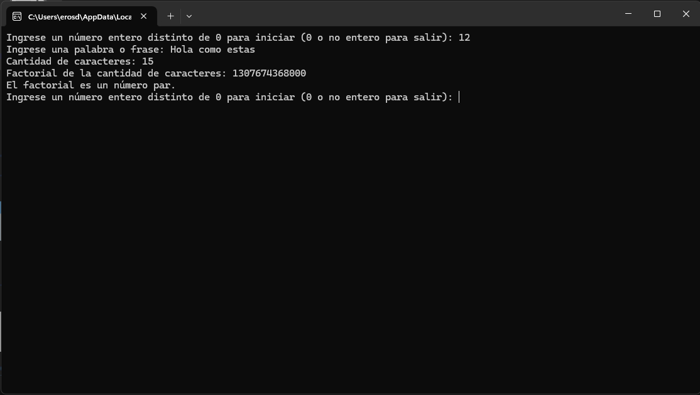

# Programa de calculo Factorial de Caracteres

Este programa en Python permite calcular el factorial de la cantidad de caracteres en una palabra o frase ingresada por el usuario. Además, indica si ese factorial es un número par o impar. El ciclo se repite mientras se ingrese un número entero distinto de 0.

## 🧠 ¿Cómo funciona?

1. Al iniciar, se solicita al usuario ingresar un número entero.
2. Si el número es distinto de 0, el programa:
   - Pide una palabra o frase.
   - Cuenta la cantidad de caracteres.
   - Calcula el factorial de esa cantidad.
   - Indica si el resultado es par o impar.
3. Luego vuelve a pedir un número y repite el proceso.
4. Si se ingresa `0` o un valor no numérico, el programa finaliza.

## 📦 Requisitos

- Python 3.0 o superior

## ▶️ Ejecución

1. Descarga el archivo [`la-trifecta.py`](la-trifecta.py).
2. Abre una terminal o consola.
3. Ejecuta el programa con el siguiente comando:

```bash
python la-trifecta.py
```

## 🖼️ Cómo se ve



<h3 align="center">Mis redes sociales:</h3>
<p align="center">
<a href="https://www.youtube.com/c/shinigamy19" target="_blank" rel="noopener"></a>
<a href="https://twitch.tv/shinigamy_19" target="_blank" rel="noopener"></a>
<a href="https://kick.com/shinigamy19" target="_blank" rel="noopener"></a>
<a href="https://discord.gg/px9fcpbp3T" target="_blank" rel="noopener"></a>
<a href="https://instagram.com/shinigamy19_art" target="_blank" rel="noopener"></a>
<a href="https://instagram.com/shinigamy19" target="_blank" rel="noopener"></a>
<a href="https://www.tiktok.com/@shinigamy_19" target="_blank" rel="noopener"></a>
<a href="https://linkedin.com/in/eros-benitez" target="_blank" rel="noopener"></a>
<a href="https://www.behance.net/shinigamy19" target="_blank" rel="noopener"></a>
<a href="https://shinigamy19.itch.io/" target="_blank" rel="noopener"></a>
<a href="https://fb.com/shinigamy19" target="_blank" rel="noopener"></a>
<a href="mailto:erosbenitezd@gmail.com" target="_blank" rel="noopener"></a>

<div>
<h3 align="center">Donaciones:</h3>
<p align="center">
<a href="https://ceneka.net/mp/d/shinigamy19" target="_blank" rel="noopener"></a>
<a href="https://www.paypal.me/shinigamy19" target="_blank" rel="noopener"></a>
<a href="https://www.patreon.com/shinigamy19" target="_blank" rel="noopener"></a>

</p>
<p align="center">
<a href='https://cafecito.app/shinigamy19' rel='noopener' target='_blank'></a></p>
</div>
